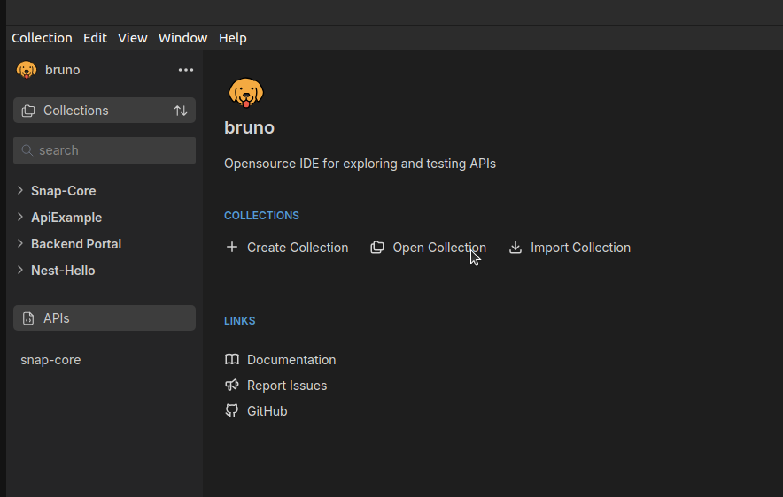

# Snap Core Bruno Collection

## Description
This is a collection of Bruno for Snap Core.

## Dependencies
1. [Node JS](https://nodejs.org/en/download/package-manager) for Bruno CLI

## Tools
Before we can use this collection, we need to install the tools.
1. [Bruno GUI](https://www.usebruno.com/downloads)
2. Bruno CLI (`npm install -g @usebruno/cli`)
3. GUM (`brew install gum` or `go install github.com/charmbracelet/gum@latest`)
4. Make (`brew install make`)

## Setup
1. Clone this repository
2. Copy the `.env.example` file to `.env`
3. Create `result` folder
3. Run `npm install`

## How To Use
### With Gui
1. Open Bruno GUI

2. Select the collection

### With CLI
1. Navigate to the collection folder
2. Run `bruno run ...`

## Additional Information
- [Bruno Documentation](https://docs.usebruno.com/introduction/what-is-bruno)